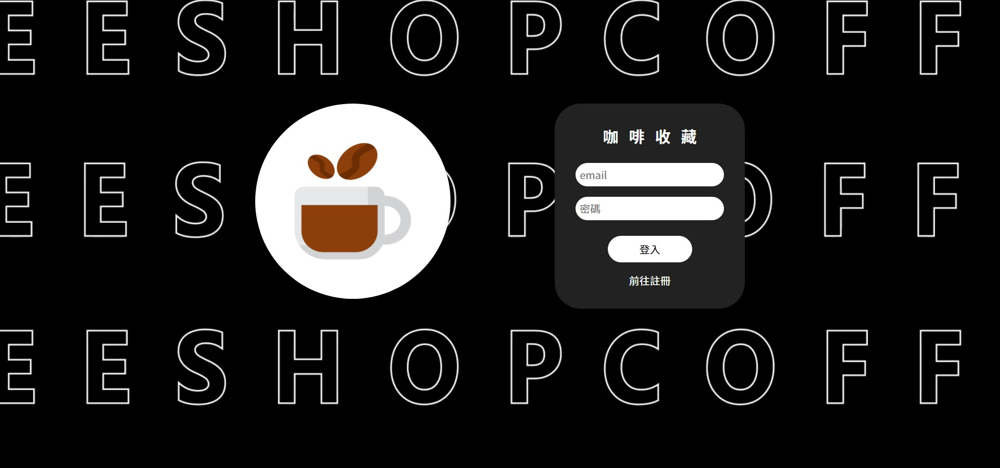

# COFFEE-SHOP

## 專案介紹
這是一個用react框架撰寫的網頁,裡面包含登入註冊,收藏、填寫表單、查看表單資料和收藏店家的功能。
資料庫的部分是用firebase的即時資料庫與authentiction，UIUX設計則是用figma畫圖。

首先是登入頁面，登入和註冊的背景動畫是用ae製作的，並接上firebase的authentication

註冊頁面

註冊和登入都有設useNavigate()導入mainPage，這個頁面可以查看店家資料並進行收藏

另外，mainPage也有做RWD的效果

收藏店家後，可以去使用者功能查看已收藏的餐廳

除了收藏餐廳，這裡也收錄了撰寫評論的功能

還有查看評論的功能

## 使用方式
須確認已安裝 node.js 與 npm

1.打開終端機,Clone 專案至本機

git clone https://github.com/Whps40333/coffee-shop.git
2.進入專案資料夾

cd coffee-shop
3.安裝 npm 套件

npm install
4.啟動專案

npm start
5.成功後會自動開啟網站
